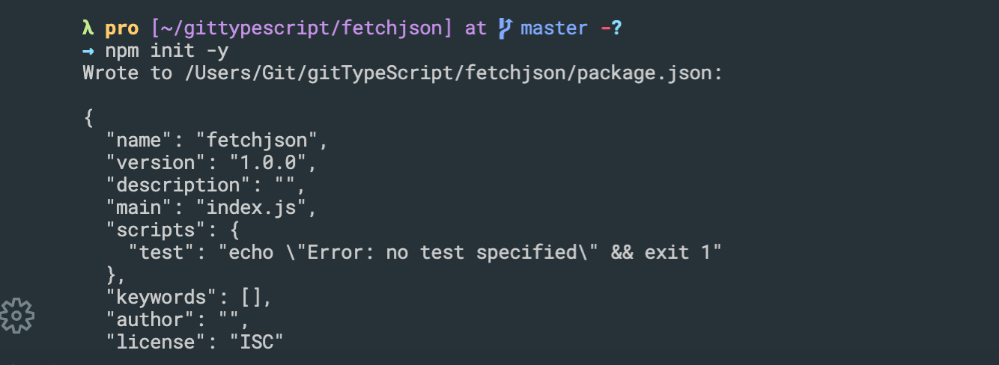

## Environment Setup

---

## First App


- `npm install axios`
- create index.ts

- go to `https://jsonplaceholder.typicode.com/`

- click `/todos`
- `https://jsonplaceholder.typicode.com/todos/1`
- index.ts
```ts
import axios from 'axios';

const url = 'https://jsonplaceholder.typicode.com/todos/1';

axios.get(url).then(response =>{
    console.log(response.data);
});
```
- now we try to compiler .ts to .js

- `node index.js`

---

- OR WE CAN USE 2ND WAY:

---

## one quick change
## Catching Errors with Typescript

