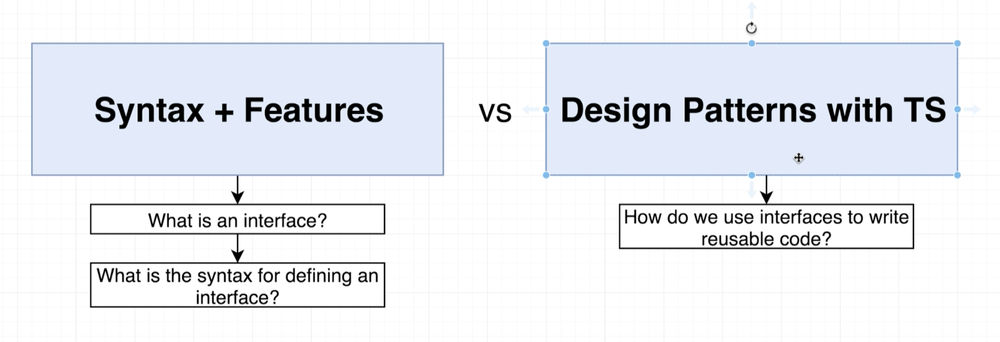
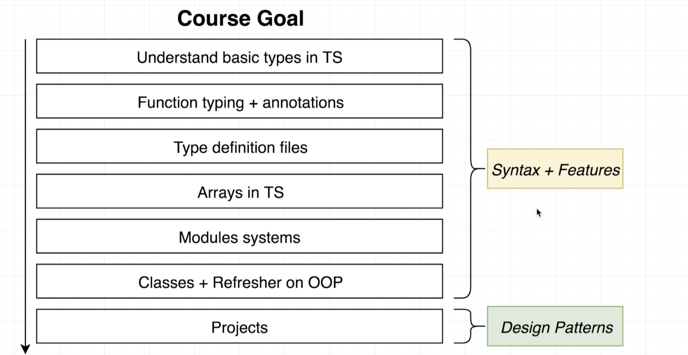
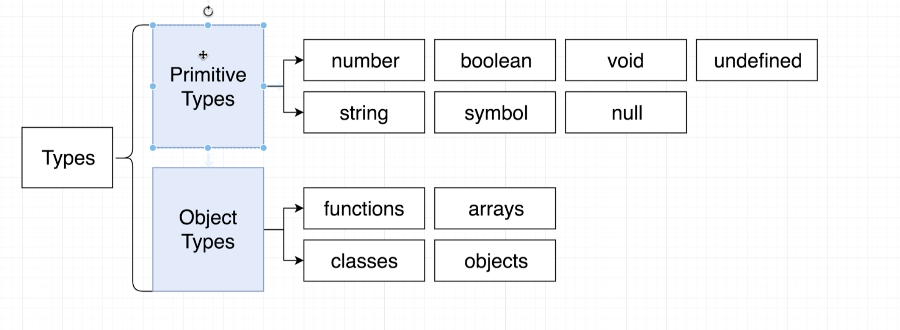
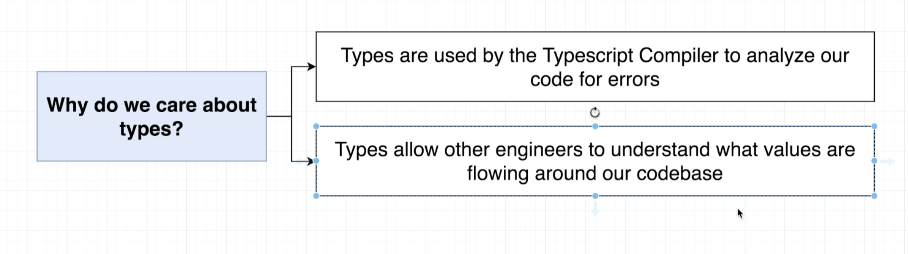
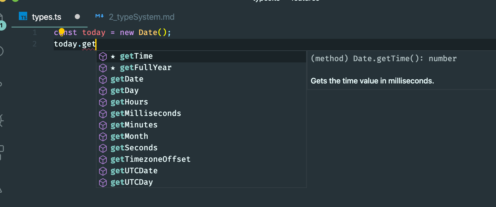
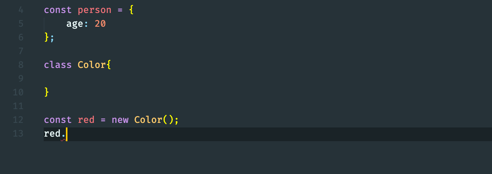
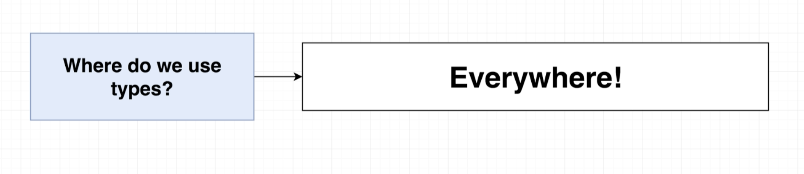

---

## Type
- update index.ts
```ts
import axios from 'axios';

const url = 'https://jsonplaceholder.typicode.com/todos/1';

interface Todo{
    id: number;
    title: string;
    completed: boolean;
}

axios.get(url).then(response =>{
    const todo = response.data as Todo;

    const id = todo.id;
    const title = todo.title;
    const completed = todo.completed;
});
```
---

## More on Types


---

## Examples of Types



