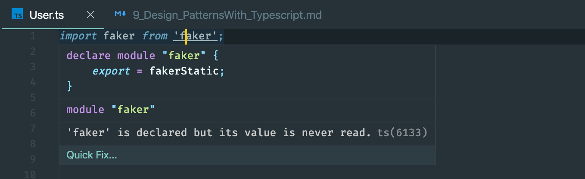

## Design Patterns
- focus on design patterns
- write really reusable code


- `npm install -g parcel-bundler`
---

## Bundling with Parcel

- create a new folder maps


- create index.html
- create a folder `src/index.ts`
- index.html
```html
<!DOCTYPE html>
<html lang="en">
<head>
    <meta charset="UTF-8">
    <meta name="viewport" content="width=device-width, initial-scale=1.0">
    <meta http-equiv="X-UA-Compatible" content="ie=edge">
    <title>Document</title>
</head>
<body>
    <script src="./src/index.ts"></script>
    
</body>
</html>
```
- index.ts
```ts
console.log('hi there!');
```
- run `parcel index.html`


---

## Project Structure

- create User.ts
---

### Generating Random Data

- `npmjs.com`
- search `faker`
- `npm install faker` 

- run `parcel index.html` again
---

## Type Definition Files

- axios has a default Type definition file for us
- however, faker doesn't have a Type definition file
- so we have to install a type definition file manually if it is not included for us

- search `@types/faker` on npmjs.com


- so we installed 
- `parcel index.html ` agian

- now there is no error
---

## Using Type Definition files
- if we `command+click` `faker`

