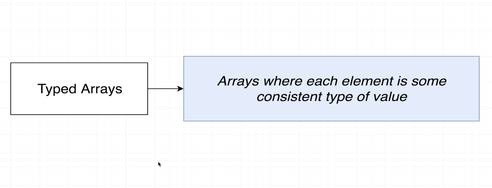
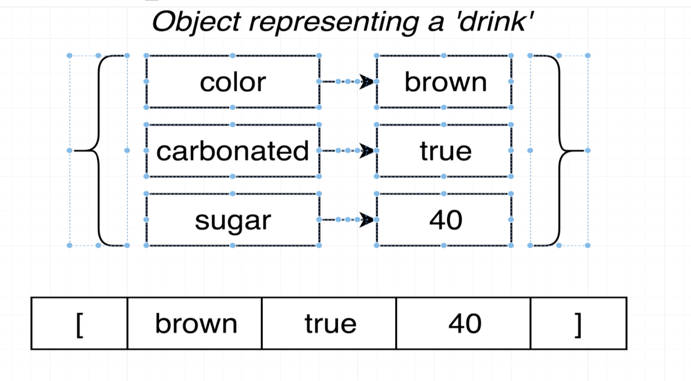

### `Arrays in TypeScript`




```ts
const carMakers = ['ford', 'toyota', 'chevy'];

const dates = [new Date(), new Date()];

// const carsByMake = [
//     ['f150'],
//     ['corolla'],
//     ['camaro']
// ];


const carsByMake: string[][] = [];

// Help with inference when extracting values
const car = carMakers[0];
const myCar = carMakers.pop();

//Prevent incompatible values
carMakers.push(100);


//Help with 'map'
carMakers.map((car: string): string => {
    return car.toUpperCase();
});
```


### `Multiple Types in Arrays`
```ts
//Flexible types
const importantDates: (Date | string)[] = [new Date()];
importantDates.push('2030-10-10');
importantDates.push(new Date());
```


### `Tuples in Typescript`

```ts
const drink = {
    color: 'brown',
    carbonated: true,
    sugar: 40
};

// const pepsi: [string, boolean, number] = ['brown', true, 40];


//Type alias
type Drink = [string, boolean, number];

const pepsi: Drink = ['brown', true, 40];
const sprite: Drink = ['clear', true, 40];
const tea: Drink = ['brown', false, 0];

```

- why Tuples?
```ts
const carSpecs: [number, number] = [400, 3354];

const carStats = {
    horsepower: 400,
    weight: 3354
};
```

