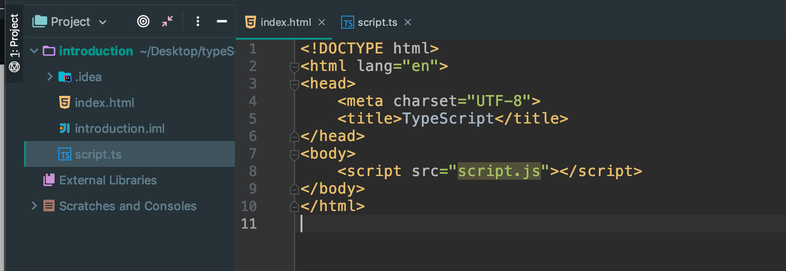
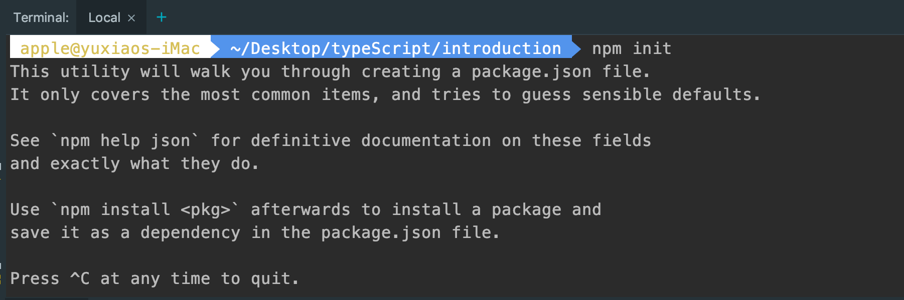
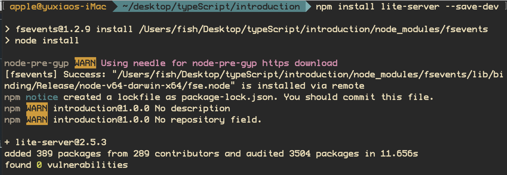
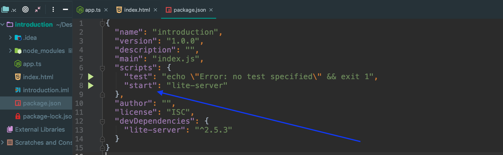
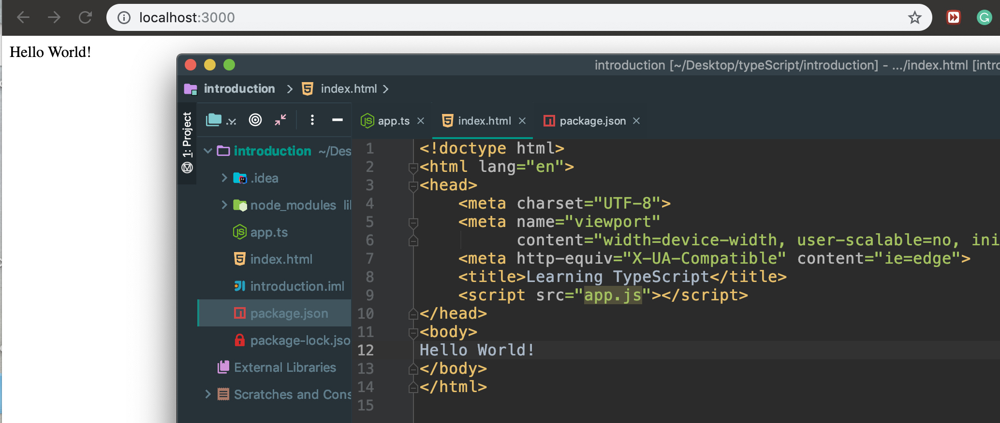
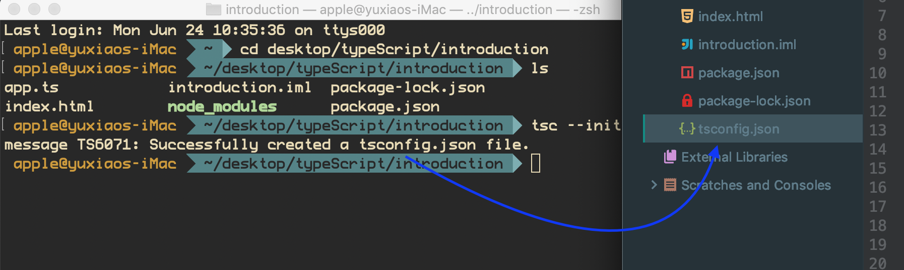
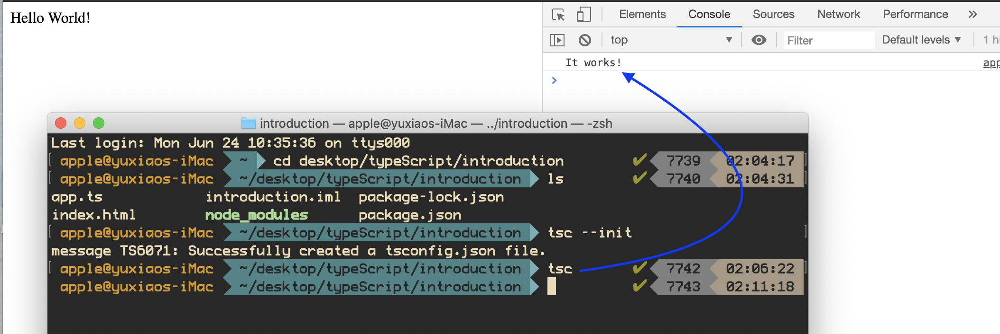

# TypeScript
---
```ts
# sudo npm -g install typescript

How to use

Run "npm install" to install the required dependencies

Run "tsc" to compile the TypeScript code

Run "npm start" to run the development server (lite-server)

```
- create a typeScript project


- on terminal:  npm init


```ts
npm install lite-server --save-dev
```


- add "start" into "scripts"


- enter: npm start

- adding a string into body


- open a new terminal, enter:  
```ts
 tsc --init
```


- since there is not a .js file


- therefore, we should run 'tsc', it will complie a .ts file to .js file
- then, it will work



