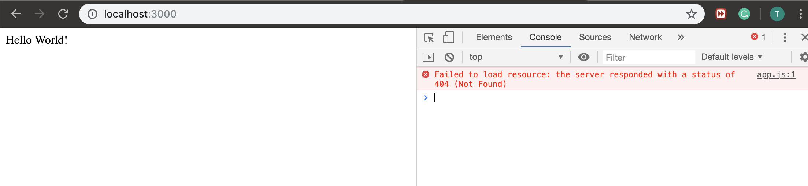

# TypeScript
---
```ts
# sudo npm -g install typescript

How to use

Run "npm install" to install the required dependencies

Run "tsc" to compile the TypeScript code

Run "npm start" to run the development server (lite-server)

```
- create a typeScript project


- on terminal:  npm init


```ts
npm install lite-server --save-dev
```


- add "start" into "scripts"


- enter: npm start

- adding a string into body


- open a new terminal, enter:  
```ts
 tsc --init
```


- since there is not a .js file


- therefore, run 'tsc', it will complie a .ts file to .js file
- then, it will work


### `前置工作`
- since I have installed npm in global


- the typescript is the superset of javascript


# if we want to change the .ts codes frequently
```
tsc --help

# -w, --watch   Watch input files.
# 监视 .ts 文件

tsc -w app.ts
```


### Environment Setup

1. create a new package
`mkdir fetchJson`
`cd fetchJson`

2. npm install axios
-In a nutshell, Axios is a Javascript library used to make HTTP requests from node.js or XMLHttpRequests from the browser that also supports the ES6 Promise API. 

3. in fetchJson folder, create a index.ts
- Make a network request to fecth some JSON and print the result
- go to jsonplaceholder
[jsonplaceholder](https://jsonplaceholder.typicode.com/)
- after click the website address
-  => Resources => /todos (click /todos)
-  https://jsonplaceholder.typicode.com/todos/1

```ts
import axios from 'axios';
const url = 'https://jsonplaceholder.typicode.com/todos/1';
axios.get(url).then((response) => {
    console.log(response.data);
})
```
### Remember we can't run typescript code directly inside the browser
- we have to compile the file into plain javascript and then we can execute the resulting javascript code

- we convert ` tsc index.ts  ` to `index.js`
- now we run `index.js`
`node index.js`

```ruby
{ userId: 1, 
    id: 1, 
    title: 'delectus aut autem', 
    completed: false }
```

- we can combine ` tsc index.ts  ` and `node index.js` to `ts-node index.ts`

```ruby
λ pro [Desktop/typeScript/fetchJson] → ts-node index.ts      
{ userId: 1, id: 1, title: 'delectus aut autem', completed: false }
```


### now try this code:
```ts
import axios from 'axios';
/* 
{ 
    userId: 1, 
    id: 1, 
    title: 'delectus aut autem', 
    completed: false 
}
*/

const url = 'https://jsonplaceholder.typicode.com/todos/1';
axios.get(url).then((response) => {
    // console.log(response.data);
    const todo = response.data;
    const ID = todo.ID;
    const title = todo.Title;
    const finished = todo.finished;

    console.log(`
    The Todo with ID: ${ID}
    Has a little of: ${title}
    Is it finished? ${finished}
    `);
})


/*  terminal
λ pro [Desktop/typeScript/fetchJson] → ts-node index.ts      

    The Todo with ID: undefined
    Has a little of: undefined
    Is it finished? undefined
*/
```

### catching error with TypeScript

`interface`
- interface in typescript are used to define the structure of an object.

- so it has now underlined three properties to tell us: Hey developer you might be doing somthing wrong here


`updting index.ts`
```ts
//catching error with TypeScript
import axios from 'axios';

interface Todo{
    id: number;
    title: string;
    completed: boolean;
}
const url = 'https://jsonplaceholder.typicode.com/todos/1';
axios.get(url).then((response) => {
    // console.log(response.data);
    const todo = response.data as Todo;
    //this tell typescript that this response.data right here is going to on of those to dos
    const ID = todo.id;
    const title = todo.title;
    const completed = todo.completed;

    console.log(`
    The Todo with ID: ${ID}
    Has a little of: ${title}
    Is it finished? ${completed}
    `);
})

/* 
λ pro [Desktop/typeScript/fetchJson] → ts-node index.ts

    The Todo with ID: 1
    Has a little of: delectus aut autem
    Is it finished? false
 */
```


### Catching More Errors

`updating index.ts`
```ts
//Catching More Errors
import axios from 'axios';
interface Todo{
    id: number;
    title: string;
    completed: boolean;
}

const url = 'https://jsonplaceholder.typicode.com/todos/1';
axios.get(url).then((response) => {
    // console.log(response.data);
    const todo = response.data as Todo;
    //this tell typescript that this response.data right here is going to on of those to dos
    const id = todo.id;
    const title = todo.title;
    const completed = todo.completed;

    logTodo(id, completed, title);
});

const logTodo = (id, title, completed) => {
    console.log(`
    The Todo with ID: ${id}
    Has a little of: ${title}
    Is it finished? ${completed}
    `);
};

/* 
λ pro [Desktop/typeScript/fetchJson] → ts-node index.ts

    The Todo with ID: 1
    Has a little of: false
    Is it finished? delectus aut autem
*/
```
- this has an error; javascript can not find this error
- However, we can using typescript syntax to find out this error:

```ts
λ pro [Desktop/typeScript/fetchJson] → ts-node index.ts

    The Todo with ID: 1
    Has a little of: delectus aut autem
    Is it finished? false
```

- this two examples of why we like to use typescript we just saw two examples of extremely common errors. 
- like people making typos(打字错误) on object properties that happens every day probably thousands of times a day across the world.
