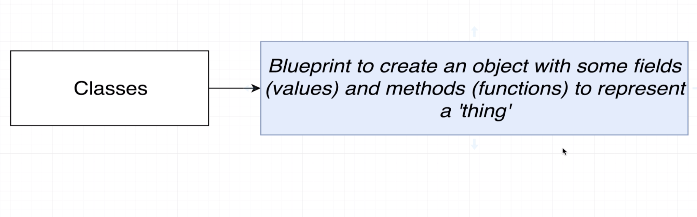
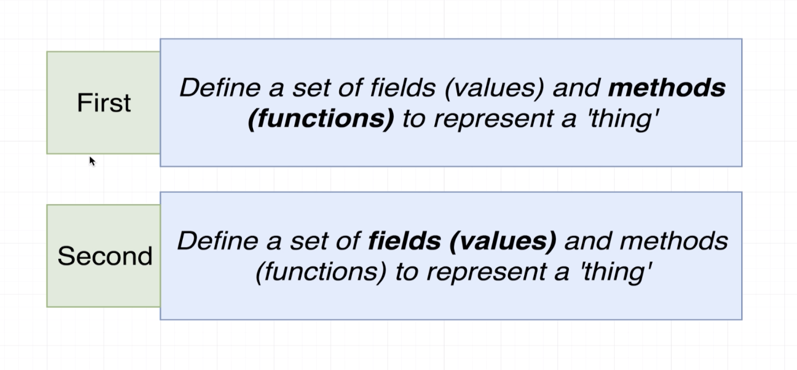
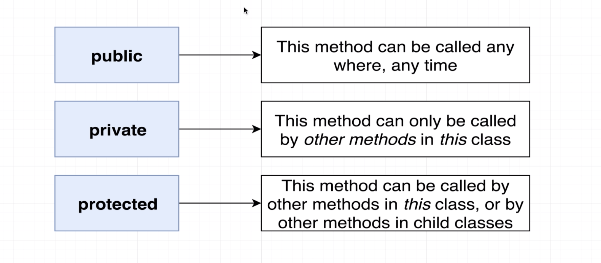
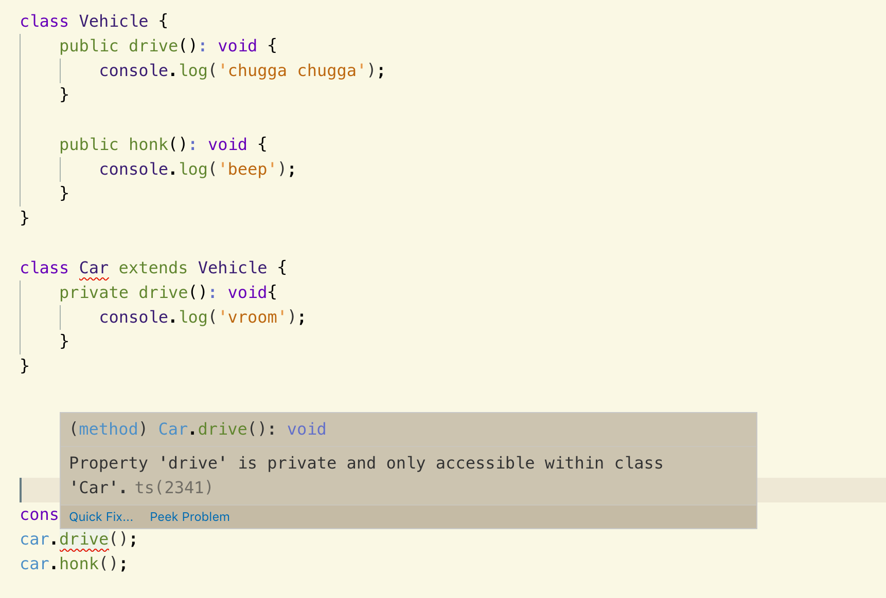

### `class`




```ts
class Vehicle {
    drive(): void{
        console.log('chugga chugga');
    }

    honk(): void{
        console.log('beep');
    }
}

const vehicle = new Vehicle();
vehicle.drive();
vehicle.honk();
```


### `Basic Inheritance`
```ts
class Vehicle {
    drive(): void {
        console.log('chugga chugga');
    }

    honk(): void {
        console.log('beep');
    }
}


class Car extends Vehicle {
}

const car = new Car();
car.drive();
car.honk();
/* 
chugga chugga
beep
*/
```


- we can overrid a method on the child class we refer to talk car as a child class 
```ts
class Vehicle {
    drive(): void {
        console.log('chugga chugga');
    }

    honk(): void {
        console.log('beep');
    }
}


class Car extends Vehicle {
    drive(): void{
        console.log('vroom');
    }
}

const car = new Car();
car.drive();
car.honk();
/* 
vroom
beep
*/
```


### `Instance Method Modifiers`


- public



- private
```ts
class Vehicle {
    
    public honk(): void {
        console.log('beep');
    }
}

class Car extends Vehicle {
    private drive(): void{
        console.log('vroom');
    }
    startDrivingProcess(): void{
        this.drive();
    }
}

const car = new Car();
car.startDrivingProcess();
car.honk();
```


- protected
```ts
class Vehicle {
    
    protected honk(): void {
        console.log('beep');
    }
}

class Car extends Vehicle {
    private drive(): void{
        console.log('vroom');
    }
    startDrivingProcess(): void{
        this.drive();
        this.honk();
    }
}

const car = new Car();
car.startDrivingProcess();
```


### `Fields in Classes`
```ts
class Vehicle {

    constructor(public color: string){}

    protected honk(): void {
        console.log('beep');
    }
}

const vehicle = new Vehicle('orange');
console.log(vehicle.color);
```

