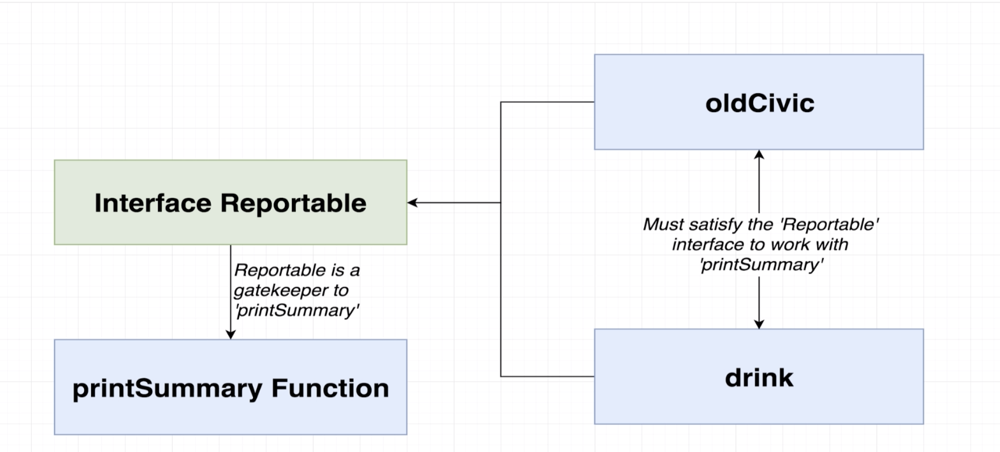
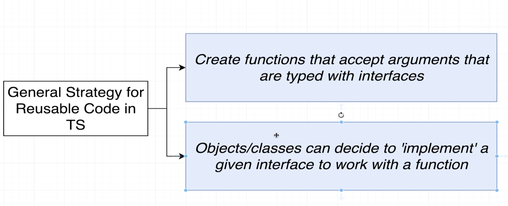
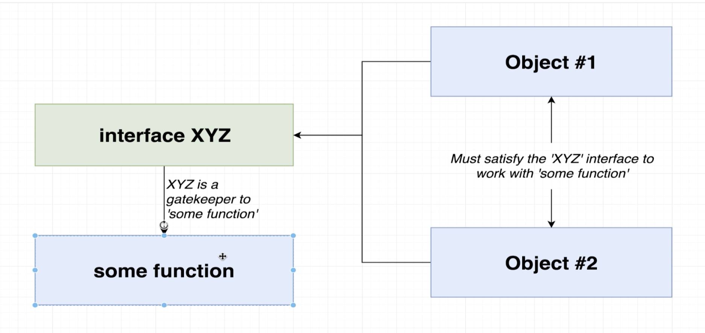

### `interface`

- without interface:
```ts
const oldCivic = {
    name: 'civic',
    year: 2000,
    broken: true
};

const printVehicle = (vehicle: { name: string; year: number; broken: boolean }): void => {
    console.log(`Name: ${vehicle.name}`);
    console.log(`Year: ${vehicle.year}`);
    console.log(`Name: ${vehicle.broken}`);
}

printVehicle(oldCivic);
```

- the problem is that `const printVehicle = (vehicle: { name: string; year: number; broken: boolean }): void => {` this hard code is too hard to read.

### `Fixing long Annotations with interface`
```ts
interface Vehicle {
    name: string;
    year: number;
    broken: boolean;
}

const oldCivic = {
    name: 'civic',
    year: 2000,
    broken: true
};

const printVehicle = (vehicle: Vehicle): void => {
    console.log(`Name: ${vehicle.name}`);
    console.log(`Year: ${vehicle.year}`);
    console.log(`Name: ${vehicle.broken}`);
}

printVehicle(oldCivic);
```


### `Syntax Around Interfaces`
```ts
interface Vehicle {
    name: string;
    year: Date;
    broken: boolean;
    summary(): string;
}

const oldCivic = {
    name: 'civic',
    year: new Date(),
    broken: true,
    summary(): string{
        return `${this.name}`;
    }
};

const printVehicle = (vehicle: Vehicle): void => {
    console.log(vehicle.summary());
}

printVehicle(oldCivic);
```


### `Code Reuse with Interface`

```ts
interface Reportable{
    summary(): string;
}

const oldCivic = {
    name: 'civic',
    year: new Date(),
    broken: true,
    summary(): string{
        return `Name: ${this.name}`;
    }
};

const drink = {
    color: 'brown',
    carbonated: true,
    sugar: 40,
    summary(): string {
        return `My drink has ${this.sugar} grams of sugar`;
    }
}

const printVehicle = (item: Reportable): void => {
    console.log(item.summary());
}

printVehicle(oldCivic);
printVehicle(drink);

/*  output:
Name: civic
My drink has 40 grams of sugar
*/
```



### `General Plan with Interfaces`




