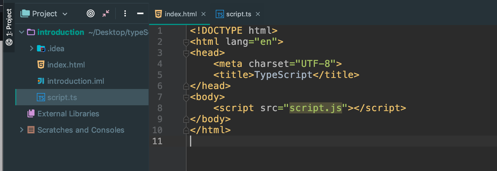

### Type System



- WHy do we care about types?
  1. Types are used by the Typescript Compiler to analyze our code for errors
  2. Types allow other engineers to understand what values are following around our codebase

- When do we use types? --- Everywhere!

```ts
const today = new Date();
today.getMonth();

const person = {
    age: 20
};


class Color{

}

const red = new Color();
```


```ts
let apples: number = 5;
let speed: string = "fast";
let hasName: boolean = true;

let nothingMuch: null = null;
let nothing: undefined = undefined;

//built in objects
let now: Date = new Date();
```

### `Object Literal Annotations`
```ts
//Array
let colors: string[] = ['red', 'green', 'blue'];
let myNumbers: number[] = [1,2,3];
let truths: boolean[] = [true, true, false];

// Classes
class Car{

}
let car: Car = new Car();

// Object literal
let point: {x: number; y: number} = {
    x: 10,
    y: 20
};

```


### `Annotations around Functions`
```ts
//Function
const logNumber:(i: number)=> void = (i: number) => {
    console.log(i);
};
```


### `understanding interface`


### `Any type`

-When to use annotations
  1. Function that returns the 'any' type
```ts
const json = '{"x":10, "y":20}';
const coordinates = JSON.parse(json);
console.log(coordinates); //{x:10, y:20};
```


### `Fixing Any type`

```ts
// fixing Any type
const json = '{"x":10, "y":20}';
const coordinates:{x: number; y: number} = JSON.parse(json);
console.log(coordinates); //{x:10, y:20};
```


### `Delayed Initialization`
//2. When we decalre a variable on one line 
// and initalizate it later
```ts
//2. When we decalre a variable on one line 
// and initalizate it later
let words = ['red', 'green', 'blue'];
let foundWord: boolean;

for(let i=0; i<words.length; i++){
    if(words[i] === 'green'){
        foundWord = true;
    }
}
```


### `When Interface doesn't work`
```ts
//3. Variable whose type cannot be inferred correctly
let numbers = [-10, -1, 12];
let numberAboveZero: boolean | number = false;

for(let i=0; i<numbers.length; i++){
    if(numbers[i] > 0){
        numberAboveZero = numbers[i];
    }
}
```


